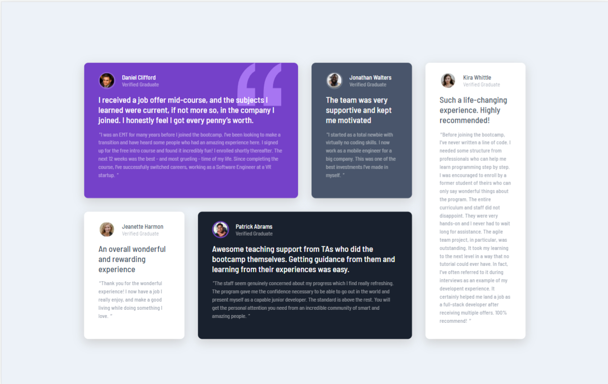

# Frontend Mentor - Testimonials grid section solution

This is a solution to the [Testimonials grid section challenge on Frontend Mentor](https://www.frontendmentor.io/challenges/testimonials-grid-section-Nnw6J7Un7). Frontend Mentor challenges help you improve your coding skills by building realistic projects. 

## Table of contents

- [Overview](#overview)
  - [The challenge](#the-challenge)
  - [Screenshot](#screenshot)
  - [Links](#links)
- [My process](#my-process)
  - [Built with](#built-with)
  - [What I learned](#what-i-learned)
- [Author](#author)

## Overview

### The challenge

Users should be able to:

- View the optimal layout for the site depending on their device's screen size

### Screenshot




### Links

- Repository URL: (https://github.com/Deva-Mari/Testimonials-grid-section)
- Live Site URL: (https://voluble-peony-253e35.netlify.app/)

## My process

### Built with

- Semantic HTML5 markup
- Sass Variables
- CSS Grid
- Mobile-first workflow
- [React](https://reactjs.org/) - JS library
- [Typescript](https://www.typescriptlang.org/)

### What I learned

- learned how to use TypeScript
- got more comfortable with css grid
```css
  .grid {
    padding: 5rem 0;
    width: 75%;
    margin: auto;
    display: grid;
    grid-template-columns: 1fr 1fr 1fr 1fr;
    grid-template-areas:
      "one one two five"
      "three four four five";
  }
  .id1 {
    grid-area: one;
  }
```
- got more comfortable conditionally importing images
```js
  // importing client image conditionally
  const [clientImage, setClientImage] = useState("");
  let imgName = props.picture;
  import(`../assets/${imgName}`).then((image) => setClientImage(image.default));
```

- used props in classNames
```js
<div
      className={`${styles.card} ${styles[props.background]} ${
        styles[`id` + props.id]
      }`}
    >
```
## Author

- Website - [Deva Mari](https://devamari.com/)
- Frontend Mentor - [@Deva-Mari](https://www.frontendmentor.io/profile/Deva-Mari)
- GitHub- [@Deva-Mari](https://github.com/Deva-Mari)